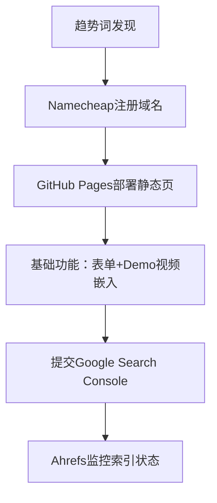
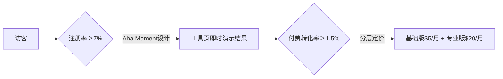

# 哥飞SEO实操体系完整指南（开发者深度适配版）

## 🔍 一、关键词策略：低成本抢占流量入口（详细实操）

### 1. "新词红利"捕捉法
**工具组合与操作：**
- Google Trends：筛选"过去12个月上升趋势＞500%"的词（例："AI voice cloning 2025"）
- KGR值计算：满足"搜索量＜250 + 竞品页面＜10"（公式：KGR = （竞品页面数/月搜索量）x 100%），KGR＜0.25为优质词

**72小时执行流：**


**案例细节：**
程序员夫妇针对"BBQ温度监控工具"新词：
- 使用Bootstrap模板24小时上线
- 技术栈：HTML5 + Vanilla JS
- 首周获200+点击
- 单月自然流量50K

### 2. 搜索意图分层优化
| 意图类型       | 页面类型          | 开发实现                              | 案例效果                  |
|----------------|-------------------|--------------------------------------|---------------------------|
| 高转化词       | "Best X for Y"对比页 | 动态表格（JSON数据驱动+React渲染）   | Notion vs Coda页月引流3K |
| 竞品截流       | "How A beats B"页  | 标题嵌入竞品品牌词+功能对比图表      | ClickUp截流Asana流量+40% |
| 问题词         | "Fix X Error"教程页 | 错误代码检测工具+自动解决方案推荐    | GPT-4报错页转化率12%    |

## ⚙️ 二、技术SEO：爬虫友好架构设计（开发者适配版）

### 1. 导航站权重提升术
**首页"炒豆子"区：**
```python
# 后端逻辑示例（Python）
def update_hot_urls():
    unindexed_urls = Url.objects.filter(
        is_indexed=False, 
        created_at__gte=timezone.now()-timedelta(days=3)
    )[:10]
    cache.set('rotating_urls', unindexed_urls, 600)  # 10分钟刷新
```

**多维度聚合页：**
- `/products/a-z`：Apache生成静态页
- `/video-editing-tools`：Algolia即时搜索
- `/company/products`：GraphQL API拉取数据

### 2. 外链建设自动化路径
| 渠道         | 技术方案                                                                 | 代码工具                  |
|--------------|-------------------------------------------------------------------------|--------------------------|
| 导航站收录   | Python自动提交至ProductHunt（API调用+表单填充）                         | Selenium+Requests        |
| 破损链接重建 | Ahrefs API扫描竞品404页 → 生成替代内容并邮件通知                        | BeautifulSoup+SMTP       |
| .edu外链获取 | 爬取高校资源页联系人 → 邮件投递免费工具授权码                          | Scrapy+Mailgun API       |

## ✍️ 三、内容生产：AI增效与增量价值设计（防算法惩罚）

### 1. 增量信息框架
```python
# AI生成初稿后的人工注入逻辑
def inject_value(ai_content, keyword):
    # 添加独家测试数据
    if "performance test" in keyword:
        return ai_content + f"\n\n## 实测数据\n{get_tool_performance()}"
    # 添加UGC案例
    elif "case study" in keyword:
        return ai_content + f"\n\n## 用户证言\n{get_user_case()}"
    return ai_content
```

### 2. 结构化数据提权
**WordPress配置示例：**
```php
// RankMath Schema标记添加
add_filter('rank_math/schema/type', function($type) {
    if (is_singular('software')) {
        $type['softwareApplication'] = [
            'name' => get_the_title(),
            'author' => [
                '@type' => 'Person',
                'name' => '真实姓名',
                'url' => 'https://linkedin.com/in/xxx'
            ]
        ];
    }
    return $type;
});
```

## 💰 四、流量变现：独立开发者收益模型（公式+参数）

### 1. AdSense优化公式
```math
收益 = 展示量 × CTR × CPC
```
**关键参数：**
- 展示量＞10K/日：需移动端广告位≥3
- CTR＞3%：广告位嵌入内容中部
- 工具类CPC≈$0.8

### 2. 订阅转化漏斗


## 🛡️ 五、避坑指南：算法红线与抗风险策略

### 1. 谷歌AI内容识别特征
**致命问题：**
- 句式重复度＞30%
- 缺乏实体细节（如具体时间/人物）
- 无作者凭证

**解决方案：**
```bash
# 内容检测脚本示例
grep -o -i "according to" article.txt | wc -l  # 检查模板化句式
```

### 2. "果园模型"站群管理
**服务器架构：**
- 主力站：AWS Lightsail $5/月
- 测试站：Vercel免费托管

**自动化监控：**
```bash
# 每日排名监控脚本
curl "https://api.serpstack.com/search?access_key=YOUR_KEY&query=${KEYWORD}" | jq '.organic_results[] | select(.position <= 10)'
```

## 🔧 哥飞推荐工具链（开发者适配版）

| 类型       | 工具/API           | 使用场景                  | 代码示例                  |
|------------|--------------------|---------------------------|---------------------------|
| 关键词挖掘 | KeywordFinder API  | 实时筛KGR词               | `GET /keywords?kgr_max=0.25` |
| 内容生成   | Gemini 1.5        | 注入私有数据              | 加载本地SQLite性能数据    |
| 外链监控   | Ahrefs API         | 竞品外链分析              | 定时爬取竞品/best-tools页 |
| 排名预警   | SerpAPI + Slack    | TOP10自动告警             | Python+Slack Webhook      |

> 💡 **实战操作清单：**
> 1. 今日：用KGR筛3个词 → 注册域名
> 2. 24小时：GitHub Pages上线MVP
> 3. 48小时：提交GSC + 配置Ahrefs监控
> 4. 每日：人工注入1篇AI内容
> 5. 每周：扫描竞品404页重建外链
> 6. 每月：更新30%旧内容 + 新增1个子站 