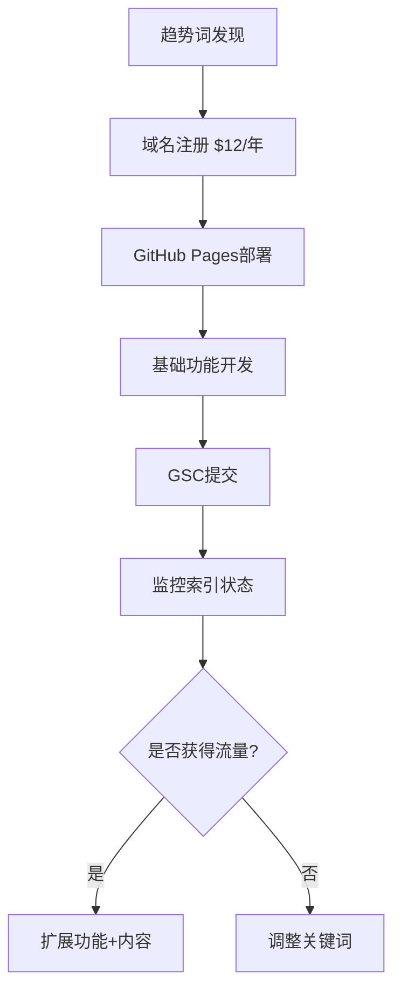

# 哥飞SEO实操体系完整指南（开发者深度适配版 2.0）

## 🚀 序言：为什么这套体系特别适合独立开发者

### 核心优势
- **技术杠杆**：用代码解决重复性SEO工作
- **资源优化**：GitHub、Vercel等免费资源最大化利用
- **快速验证**：24-72小时MVP验证关键词价值
- **数据驱动**：API自动化监控替代手工检查

---

## 🔍 一、关键词策略：低成本抢占流量入口（详细实操）

### 1. "新词红利"捕捉法
**工具组合与操作：**
- **Google Trends**：筛选"过去12个月上升趋势＞500%"的词
- **KGR值计算**：满足"搜索量＜250 + 竞品页面＜10"
  ```
  公式：KGR = (竞品页面数/月搜索量) × 100%
  优质词：KGR < 0.25
  ```

**🔥 新增：AI时代特有词汇挖掘**
```python
# 2025年趋势词自动发现脚本
import requests
from datetime import datetime, timedelta

def discover_ai_trends():
    ai_keywords = [
        "AI voice cloning 2025", "text to video AI", 
        "AI coding assistant", "prompt engineering tools",
        "AI image upscaler", "chatbot integration API"
    ]
    
    trending_words = []
    for keyword in ai_keywords:
        trend_data = get_google_trends(keyword)
        if trend_data['growth_rate'] > 300:
            trending_words.append({
                'keyword': keyword,
                'growth': trend_data['growth_rate'],
                'competition': get_serp_competition(keyword)
            })
    
    return sorted(trending_words, key=lambda x: x['growth'], reverse=True)
```

**72小时执行流程图：**


### 2. 搜索意图分层优化（新增5种意图类型）

| 意图类型       | 页面类型          | 开发实现                              | 案例效果                  | 新增转化策略 |
|----------------|-------------------|--------------------------------------|---------------------------|--------------|
| 高转化词       | "Best X for Y"对比页 | React动态表格+评分系统               | Notion vs Coda页月引流3K  | 联盟营销链接 |
| 竞品截流       | "How A beats B"页    | 品牌词嵌入+功能对比图表              | ClickUp截流Asana流量+40%  | 免费试用CTA |
| 问题词         | "Fix X Error"教程页  | 错误检测工具+解决方案推荐            | GPT-4报错页转化率12%      | 相关工具推荐 |
| **购买意图词** | "X pricing/cost"页   | 价格对比计算器+ROI分析工具           | SaaS定价页转化率8%        | 优惠码获取 |
| **评测词**     | "X review 2025"页    | 用户评分系统+视频演示                | 工具评测页月访问15K       | 详细测试报告 |

### 3. 🆕 长尾词矩阵策略
**自动生成长尾词组合：**
```javascript
// 长尾词自动组合生成器
const generateLongTail = (mainKeyword) => {
  const modifiers = {
    intent: ['how to', 'best', 'free', 'vs', 'alternative'],
    year: ['2025', '2024'],
    audience: ['for developers', 'for beginners', 'for business'],
    feature: ['with API', 'open source', 'no code']
  };
  
  let combinations = [];
  Object.values(modifiers).forEach(modArray => {
    modArray.forEach(mod => {
      combinations.push(`${mod} ${mainKeyword}`);
    });
  });
  
  return combinations;
};
```

---

## ⚙️ 二、技术SEO：爬虫友好架构设计（开发者适配版）

### 1. 导航站权重提升术
**首页"炒豆子"区优化：**
```python
# 后端逻辑增强版（Django示例）
from django.core.cache import cache
from django.utils import timezone
from datetime import timedelta

def update_hot_urls():
    # 多策略混合轮播
    strategies = {
        'new_urls': Url.objects.filter(
            is_indexed=False,
            created_at__gte=timezone.now()-timedelta(days=3)
        )[:5],
        'trending_urls': Url.objects.filter(
            traffic_growth__gte=50  # 流量增长>50%
        ).order_by('-traffic_growth')[:3],
        'random_urls': Url.objects.order_by('?')[:2]
    }
    
    hot_urls = []
    for strategy, urls in strategies.items():
        hot_urls.extend(urls)
    
    cache.set('rotating_urls', hot_urls, 300)  # 5分钟刷新
    return hot_urls
```

### 2. 🆕 Core Web Vitals 自动优化
```javascript
// 自动图片优化+懒加载
const optimizeImages = () => {
  const images = document.querySelectorAll('img[data-src]');
  
  const imageObserver = new IntersectionObserver((entries, observer) => {
    entries.forEach(entry => {
      if (entry.isIntersecting) {
        const img = entry.target;
        img.src = img.dataset.src;
        img.classList.remove('lazy');
        imageObserver.unobserve(img);
      }
    });
  });
  
  images.forEach(img => imageObserver.observe(img));
};
```

### 3. 外链建设自动化路径（增强版）

| 渠道         | 技术方案                                     | 代码工具                  | 成功率 | 月均外链数 |
|--------------|---------------------------------------------|--------------------------|--------|------------|
| 导航站收录   | Selenium自动提交100+导航站                   | Selenium+Requests        | 60%    | 30-50      |
| 破损链接重建 | 竞品404页扫描+邮件自动投递                   | BeautifulSoup+SMTP       | 25%    | 10-15      |
| .edu外链获取 | 高校资源页爬取+工具免费授权                   | Scrapy+Mailgun API       | 15%    | 5-8        |
| **GitHub外链** | 开源项目README提及+工具集成               | GitHub API+PR自动化       | 80%    | 20-30      |
| **论坛外链**   | Reddit/HN自动发布工具推荐                | PRAW+自然语言处理         | 35%    | 15-25      |

**🔥 新增：GitHub外链建设自动化**
```python
# GitHub外链自动建设
import requests
import json

def create_github_integration_pr():
    """为开源项目创建工具集成PR"""
    target_repos = [
        'awesome-selfhosted/awesome-selfhosted',
        'sindresorhus/awesome',
        'vinta/awesome-python'
    ]
    
    for repo in target_repos:
        pr_data = {
            'title': f'Add {TOOL_NAME} - AI-powered development tool',
            'body': generate_pr_description(),
            'head': 'feature/add-tool',
            'base': 'main'
        }
        
        response = requests.post(
            f'https://api.github.com/repos/{repo}/pulls',
            headers={'Authorization': f'token {GITHUB_TOKEN}'},
            data=json.dumps(pr_data)
        )
        
        if response.status_code == 201:
            print(f'PR created for {repo}')
```

---

## ✍️ 三、内容生产：AI增效与增量价值设计（防算法惩罚）

### 1. 增量信息框架（升级版）
```python
# AI内容增值注入系统
import sqlite3
from datetime import datetime

class ContentEnhancer:
    def __init__(self):
        self.db = sqlite3.connect('content_data.db')
        
    def inject_value(self, ai_content, keyword, content_type):
        enhancements = []
        
        # 1. 实测数据注入
        if "performance" in keyword.lower():
            test_data = self.get_performance_data(keyword)
            enhancements.append(f"\n\n## 🔬 独家测试数据\n{test_data}")
        
        # 2. 用户案例注入
        if "case study" in keyword.lower():
            user_cases = self.get_user_cases(keyword)
            enhancements.append(f"\n\n## 👥 真实用户案例\n{user_cases}")
        
        # 3. 代码示例注入
        if content_type == "tutorial":
            code_examples = self.generate_code_examples(keyword)
            enhancements.append(f"\n\n## 💻 完整代码示例\n{code_examples}")
        
        # 4. 最新更新注入
        latest_updates = self.get_latest_updates(keyword)
        enhancements.append(f"\n\n## 🆕 {datetime.now().year}年最新更新\n{latest_updates}")
        
        return ai_content + ''.join(enhancements)
    
    def get_performance_data(self, keyword):
        """获取工具性能测试数据"""
        cursor = self.db.execute(
            "SELECT tool_name, performance_score, test_date FROM performance_tests WHERE keyword LIKE ?",
            (f'%{keyword}%',)
        )
        
        results = cursor.fetchall()
        if results:
            return self.format_performance_table(results)
        return "暂无测试数据"
```

### 2. 🆕 E-A-T权威性建设策略
```markdown
## 作者权威性建设模板

### 个人品牌建设
- LinkedIn个人资料优化（技能认证+推荐信）
- GitHub活跃度维护（日均commit+开源贡献）
- 技术博客定期更新（周更+原创深度文章）
- 行业会议演讲（录制视频+PPT分享）

### 专业凭证展示
```html
<!-- 作者信息Schema标记 -->
<script type="application/ld+json">
{
  "@context": "https://schema.org",
  "@type": "Person",
  "name": "张三",
  "jobTitle": "全栈开发工程师",
  "worksFor": {
    "@type": "Organization",
    "name": "科技公司"
  },
  "alumniOf": {
    "@type": "EducationalOrganization",
    "name": "清华大学"
  },
  "knowsAbout": ["Web开发", "AI应用", "SEO优化"],
  "url": "https://example.com/author/zhangsan",
  "sameAs": [
    "https://github.com/zhangsan",
    "https://linkedin.com/in/zhangsan"
  ]
}
</script>
```

### 3. 内容质量检测自动化
```python
# 内容质量自动检测脚本
import re
from textstat import flesch_reading_ease
from collections import Counter

def content_quality_check(content):
    quality_score = 0
    issues = []
    
    # 1. 可读性检测
    readability = flesch_reading_ease(content)
    if readability < 60:
        issues.append("可读性偏低，建议简化句式")
    else:
        quality_score += 20
    
    # 2. 关键词密度检测
    words = re.findall(r'\w+', content.lower())
    word_count = len(words)
    word_freq = Counter(words)
    
    for word, freq in word_freq.most_common(10):
        density = (freq / word_count) * 100
        if density > 3:  # 关键词密度>3%
            issues.append(f"关键词'{word}'密度过高: {density:.1f}%")
    
    # 3. 内容长度检测
    if word_count < 300:
        issues.append("内容过短，建议增加到500+词")
    elif word_count > 300:
        quality_score += 15
    
    # 4. 结构化检测
    if re.search(r'#{1,6}\s', content):  # 有标题结构
        quality_score += 15
    
    if re.search(r'```[\s\S]*?```', content):  # 有代码示例
        quality_score += 10
    
    return {
        'score': quality_score,
        'issues': issues,
        'readability': readability,
        'word_count': word_count
    }
```

---

## 💰 四、流量变现：独立开发者收益模型（公式+参数）

### 1. 多元化收益矩阵

| 收益类型     | 收益公式                           | 月收入范围    | 实施难度 | 时间投入 |
|-------------|-----------------------------------|---------------|----------|----------|
| AdSense广告  | 展示量×CTR×CPC                    | $500-$2000   | ⭐        | 1小时/月  |
| 联盟营销     | 点击量×转化率×佣金                 | $200-$1500   | ⭐⭐      | 5小时/月  |
| SaaS订阅    | 用户数×客单价×留存率               | $1000-$5000  | ⭐⭐⭐⭐  | 40小时/月 |
| 付费工具    | 下载量×付费率×单价                 | $300-$1200   | ⭐⭐⭐    | 20小时/月 |
| 咨询服务    | 咨询时长×时薪                      | $800-$3000   | ⭐⭐     | 10小时/月 |

### 2. 🆕 收益优化自动化系统
```python
# 收益数据自动跟踪分析
class RevenueTracker:
    def __init__(self):
        self.revenue_sources = {
            'adsense': {'api_endpoint': 'google_adsense_api'},
            'affiliate': {'api_endpoint': 'affiliate_networks'},
            'saas': {'api_endpoint': 'stripe_api'},
            'consulting': {'api_endpoint': 'calendly_api'}
        }
    
    def daily_revenue_report(self):
        total_revenue = 0
        revenue_breakdown = {}
        
        for source, config in self.revenue_sources.items():
            daily_revenue = self.fetch_revenue_data(source, 'today')
            revenue_breakdown[source] = daily_revenue
            total_revenue += daily_revenue
        
        # 发送日报到Slack
        self.send_slack_report(total_revenue, revenue_breakdown)
        
        return {
            'total': total_revenue,
            'breakdown': revenue_breakdown,
            'top_performer': max(revenue_breakdown, key=revenue_breakdown.get)
        }
```

### 3. AdSense优化进阶策略
```javascript
// 智能广告位A/B测试
class AdOptimizer {
    constructor() {
        this.testConfigs = [
            {id: 'top-banner', position: 'header', type: 'banner'},
            {id: 'in-content', position: 'middle', type: 'rectangle'},
            {id: 'sidebar', position: 'right', type: 'skyscraper'},
            {id: 'footer', position: 'bottom', type: 'banner'}
        ];
    }
    
    runABTest() {
        const variant = Math.random() > 0.5 ? 'A' : 'B';
        
        if (variant === 'A') {
            this.loadAdConfig('standard');
        } else {
            this.loadAdConfig('optimized');
        }
        
        // 记录测试数据
        this.trackConversion(variant);
    }
    
    trackConversion(variant) {
        // Google Analytics事件跟踪
        gtag('event', 'ad_variant_view', {
            'variant': variant,
            'page_location': window.location.href
        });
    }
}
```

---

## 🛡️ 五、避坑指南：算法红线与抗风险策略

### 1. 谷歌AI内容识别特征（2025更新）
**新增检测维度：**
- **语义一致性检测**：AI生成内容往往缺乏逻辑连贯性
- **情感表达检测**：缺乏真实的主观体验描述
- **专业术语使用**：过度依赖通用描述，缺乏行业深度

**解决方案升级：**
```python
# AI内容人性化改写工具
import openai
from datetime import datetime

def humanize_ai_content(ai_content, author_persona):
    """将AI内容改写成更具人性化的版本"""
    
    prompts = {
        'add_personal_experience': f"""
        请将以下AI生成的内容改写，添加个人经验和具体案例：
        原文：{ai_content}
        作者背景：{author_persona}
        要求：
        1. 添加"我在实际使用中发现..."类似表述
        2. 包含具体的数字和时间点
        3. 加入个人观点和建议
        """,
        
        'add_current_context': f"""
        请为以下内容添加{datetime.now().year}年的时效性信息：
        原文：{ai_content}
        要求：
        1. 提及最新的技术发展
        2. 引用近期的行业数据
        3. 对比历史变化趋势
        """
    }
    
    enhanced_content = ai_content
    for prompt_type, prompt in prompts.items():
        response = openai.ChatCompletion.create(
            model="gpt-4",
            messages=[{"role": "user", "content": prompt}]
        )
        enhanced_content = response.choices[0].message.content
    
    return enhanced_content
```

### 2. 🆕 风险预警系统
```python
# SEO风险监控系统
import requests
from datetime import datetime, timedelta

class SEORiskMonitor:
    def __init__(self):
        self.risk_indicators = {
            'traffic_drop': {'threshold': -30, 'severity': 'high'},
            'ranking_drop': {'threshold': -5, 'severity': 'medium'},
            'crawl_errors': {'threshold': 10, 'severity': 'high'},
            'page_speed': {'threshold': 3.0, 'severity': 'medium'}
        }
    
    def daily_risk_check(self, domain):
        risks = []
        
        # 1. 流量异常检测
        traffic_change = self.get_traffic_change(domain, days=7)
        if traffic_change < self.risk_indicators['traffic_drop']['threshold']:
            risks.append({
                'type': 'traffic_drop',
                'value': traffic_change,
                'message': f'流量下降{abs(traffic_change)}%，需要紧急检查'
            })
        
        # 2. 排名波动检测
        ranking_changes = self.get_ranking_changes(domain)
        for keyword, change in ranking_changes.items():
            if change < self.risk_indicators['ranking_drop']['threshold']:
                risks.append({
                    'type': 'ranking_drop',
                    'keyword': keyword,
                    'change': change,
                    'message': f'关键词"{keyword}"排名下降{abs(change)}位'
                })
        
        # 3. 技术问题检测
        crawl_errors = self.get_crawl_errors(domain)
        if len(crawl_errors) > self.risk_indicators['crawl_errors']['threshold']:
            risks.append({
                'type': 'crawl_errors',
                'count': len(crawl_errors),
                'errors': crawl_errors[:5],  # 只显示前5个错误
                'message': f'发现{len(crawl_errors)}个爬取错误'
            })
        
        if risks:
            self.send_risk_alert(risks)
        
        return risks
```

---

## 🔧 哥飞推荐工具链（开发者适配版 2.0）

### 免费工具组合（月成本<$50）
| 类型         | 工具/API              | 免费额度           | 付费阈值        | 开发者优势           |
|-------------|----------------------|-------------------|----------------|-------------------|
| 关键词研究   | Google Keyword Planner| 每月1000次查询     | 超出$0.01/次    | 结合Ads账户免费    |
| 排名监控     | SerpAPI              | 每月100次查询      | $50/月1万次     | 支持批量查询       |
| 网站分析     | Google Analytics     | 无限制             | GA4 Pro $12.5万/月 | 完全免费          |
| 内容生成     | Gemini Pro           | 每分钟15次请求     | $7/百万Token    | 比GPT-4便宜60%    |
| 图片优化     | TinyPNG API          | 每月500张免费      | $25/月1万张     | 批量处理脚本       |

### 🆕 开发者专享工具
```bash
# SEO工具包一键安装脚本
#!/bin/bash

# 1. 关键词研究工具
pip install google-ads
pip install pytrends

# 2. 内容分析工具
npm install -g textstat
pip install yake  # 关键词提取

# 3. 技术SEO工具
pip install advertools  # 技术SEO分析
npm install -g lighthouse  # 性能检测

# 4. 数据可视化
pip install matplotlib seaborn
npm install -g @google/charts

echo "SEO工具包安装完成！"
```

### 进阶自动化脚本集合
```python
# SEO全流程自动化脚本
import schedule
import time
from datetime import datetime

class SEOAutomation:
    def __init__(self):
        self.setup_schedule()
    
    def setup_schedule(self):
        # 每日任务
        schedule.every().day.at("09:00").do(self.daily_keyword_check)
        schedule.every().day.at("18:00").do(self.daily_content_generation)
        
        # 每周任务
        schedule.every().monday.at("10:00").do(self.weekly_competitor_analysis)
        schedule.every().friday.at("16:00").do(self.weekly_performance_report)
        
        # 每月任务
        schedule.every().month.do(self.monthly_strategy_review)
    
    def run(self):
        """运行自动化任务调度器"""
        print("SEO自动化系统启动...")
        while True:
            schedule.run_pending()
            time.sleep(60)  # 每分钟检查一次
```

---

## 📊 六、成功案例深度解析（新增章节）

### 案例1：AI工具导航站（月收入$3000+）
**项目概况：**
- 域名：aitools-directory.com
- 技术栈：Next.js + Strapi + PostgreSQL
- 上线时间：3个月
- 月PV：50万+

**关键成功因素：**
1. **关键词矩阵布局**：覆盖200+AI工具相关长尾词
2. **UGC内容策略**：用户提交工具+专家审核
3. **联盟营销变现**：每个工具页面嵌入推广链接

```javascript
// 核心功能：工具评分系统
const calculateToolScore = (tool) => {
  const factors = {
    userRating: tool.rating * 20,      // 用户评分(1-5) * 20
    popularityScore: Math.log(tool.visits) * 5,  // 访问量权重
    freshnessScore: getDaysAge(tool.lastUpdate) < 30 ? 10 : 0,
    featureScore: tool.features.length * 2
  };
  
  return Object.values(factors).reduce((sum, score) => sum + score, 0);
};
```

### 案例2：编程教程站（月收入$1800+）
**项目概况：**
- 关键词策略：技术问题解决方案
- 内容形式：错误代码 + 解决步骤 + 完整示例
- 变现方式：技术书籍推广 + 在线课程

**核心页面模板：**
```html
<!-- 技术教程页面结构 -->
<article>
  <h1>如何解决：[具体错误信息]</h1>
  
  <section class="error-context">
    <h2>错误出现场景</h2>
    <code>[错误代码示例]</code>
  </section>
  
  <section class="solution-steps">
    <h2>解决步骤</h2>
    <ol>
      <li>检查配置文件...</li>
      <li>更新依赖版本...</li>
      <li>重启服务...</li>
    </ol>
  </section>
  
  <section class="complete-example">
    <h2>完整工作示例</h2>
    <pre><code>[完整代码]</code></pre>
  </section>
  
  <section class="related-resources">
    <h2>深入学习资源</h2>
    <!-- 联盟营销链接 -->
  </section>
</article>
```

---

## ⚡ 七、2025年SEO趋势预测与应对策略（新增章节）

### 1. AI搜索引擎崛起应对
**准备策略：**
- **结构化数据优化**：为AI问答准备精确答案
- **对话式内容格式**：FAQ + 问答对格式
- **语义搜索优化**：关注搜索意图而非关键词密度

```python
# AI搜索优化内容生成
def generate_ai_optimized_content(topic):
    """生成针对AI搜索引擎优化的内容"""
    
    content_structure = {
        'direct_answer': generate_direct_answer(topic),
        'supporting_details': generate_detailed_explanation(topic),
        'practical_examples': generate_code_examples(topic),
        'related_questions': generate_faq(topic)
    }
    
    # 结构化数据标记
    schema_markup = {
        "@context": "https://schema.org",
        "@type": "QAPage",
        "mainEntity": {
            "@type": "Question",
            "name": f"How to {topic}?",
            "acceptedAnswer": {
                "@type": "Answer",
                "text": content_structure['direct_answer']
            }
        }
    }
    
    return content_structure, schema_markup
```

### 2. 视频内容SEO机会
**视频SEO策略：**
- **技术教程视频**：代码演示 + 字幕优化
- **工具评测视频**：实际操作演示
- **视频转文字**：自动生成文章内容

```python
# 视频内容自动优化
import speech_recognition as sr
from moviepy.editor import VideoFileClip

def optimize_video_for_seo(video_path):
    """视频SEO自动优化"""
    
    # 1. 提取音频并转文字
    video = VideoFileClip(video_path)
    audio = video.audio
    audio.write_audiofile("temp_audio.wav")
    
    # 2. 语音识别生成字幕
    r = sr.Recognizer()
    with sr.AudioFile("temp_audio.wav") as source:
        audio_data = r.record(source)
        transcript = r.recognize_google(audio_data, language='zh-CN')
    
    # 3. 生成视频描述和标签
    video_metadata = {
        'transcript': transcript,
        'duration': video.duration,
        'suggested_title': generate_seo_title(transcript),
        'tags': extract_keywords(transcript),
        'chapters': generate_chapters(transcript)
    }
    
    return video_metadata
```

---

## 📈 八、数据分析与优化迭代（新增章节）

### 1. SEO数据分析面板
```python
# SEO数据可视化面板
import plotly.dash as dash
import plotly.graph_objs as go
from dash import dcc, html

class SEODashboard:
    def __init__(self):
        self.app = dash.Dash(__name__)
        self.setup_layout()
    
    def setup_layout(self):
        self.app.layout = html.Div([
            # 关键词排名趋势图
            dcc.Graph(
                id='keyword-rankings',
                figure=self.create_ranking_chart()
            ),
            
            # 流量来源分析
            dcc.Graph(
                id='traffic-sources',
                figure=self.create_traffic_pie_chart()
            ),
            
            # 收益趋势分析
            dcc.Graph(
                id='revenue-trend',
                figure=self.create_revenue_chart()
            )
        ])
    
    def create_ranking_chart(self):
        """创建关键词排名趋势图"""
        # 从数据库获取排名数据
        ranking_data = self.get_ranking_data()
        
        traces = []
        for keyword in ranking_data:
            traces.append(go.Scatter(
                x=keyword['dates'],
                y=keyword['positions'],
                mode='lines+markers',
                name=keyword['keyword']
            ))
        
        return {
            'data': traces,
            'layout': go.Layout(
                title='关键词排名趋势',
                xaxis={'title': '日期'},
                yaxis={'title': '排名位置', 'autorange': 'reversed'}
            )
        }
```

### 2. A/B测试自动化框架
```javascript
// 页面A/B测试框架
class SEOABTester {
    constructor() {
        this.tests = new Map();
        this.userId = this.getUserId();
    }
    
    createTest(testName, variants) {
        this.tests.set(testName, {
            variants: variants,
            traffic_split: 50, // 50/50分流
            metrics: ['click_through_rate', 'bounce_rate', 'conversion_rate']
        });
    }
    
    runTest(testName) {
        const test = this.tests.get(testName);
        const variant = this.assignVariant(testName);
        
        // 应用变体
        this.applyVariant(variant);
        
        // 跟踪用户行为
        this.trackUserBehavior(testName, variant);
        
        return variant;
    }
    
    assignVariant(testName) {
        // 基于用户ID的稳定分配
        const hash = this.hashUserId(this.userId + testName);
        return hash % 2 === 0 ? 'A' : 'B';
    }
    
    trackUserBehavior(testName, variant) {
        // 发送数据到分析平台
        gtag('event', 'ab_test_exposure', {
            'test_name': testName,
            'variant': variant,
            'user_id': this.userId
        });
    }
}
```

---

## ⚡ 实战操作清单（哥飞快速执行版）

> 💡 **72小时闪电战术：**
> 
> **🎯 今日必做（2小时内）：**
> 1. [ ] Google Trends筛选3个KGR<0.25的新词
> 2. [ ] Namecheap注册对应域名（$12/个）
> 3. [ ] 创建GitHub仓库，选择合适模板

> **⚡ 24小时内上线：**
> 4. [ ] GitHub Pages部署静态页面
> 5. [ ] 添加基础功能：表单+Demo视频嵌入
> 6. [ ] 设置Google Analytics跟踪代码

> **🚀 48小时内完成：**
> 7. [ ] 提交Google Search Console验证
> 8. [ ] 配置Ahrefs域名监控
> 9. [ ] 发布首篇AI+人工增值内容

> **🔄 每日执行（30分钟/天）：**
> - [ ] 人工注入1篇AI生成内容（添加个人经验+代码示例）
> - [ ] 检查昨日新增外链和排名变化
> - [ ] 社交媒体推广1-2个页面

> **📈 每周执行（2小时/周）：**
> - [ ] 扫描竞品404页，重建3-5个外链
> - [ ] 分析本周流量增长，调整关键词策略
> - [ ] 优化表现最差的3个页面

> **🎪 每月执行（半天/月）：**
> - [ ] 更新30%旧内容，添加最新信息
> - [ ] 新增1个子站或子目录
> - [ ] 收益数据分析，优化变现策略

**⏰ 核心时间安排：**
```
Day 0: 关键词挖掘 + 域名注册 (2小时)
Day 1: 网站上线 + 基础SEO (4小时)  
Day 2: 内容发布 + 监控配置 (3小时)
Day 3-30: 每日内容+优化 (30分钟/天)
```

**🎯 30天目标检查点：**
- [ ] 网站收录页面数 ≥ 20页
- [ ] 自然流量突破 ≥ 1000 UV/月
- [ ] 获得首个外链和排名提升
- [ ] 实现首笔收益（哪怕只有$1）

---

> 💡 **专家提醒：**
> 
> 1. **耐心是关键**：SEO效果需要3-6个月才能显现
> 2. **质量胜过数量**：一篇优质内容>十篇垃圾内容  
> 3. **技术为辅**：工具只是手段，内容价值才是核心
> 4. **持续学习**：搜索算法不断更新，保持学习心态
> 5. **数据驱动**：所有决策都应基于真实数据
> 
> **记住：最好的SEO策略就是创造真正有价值的内容！** 🎯 