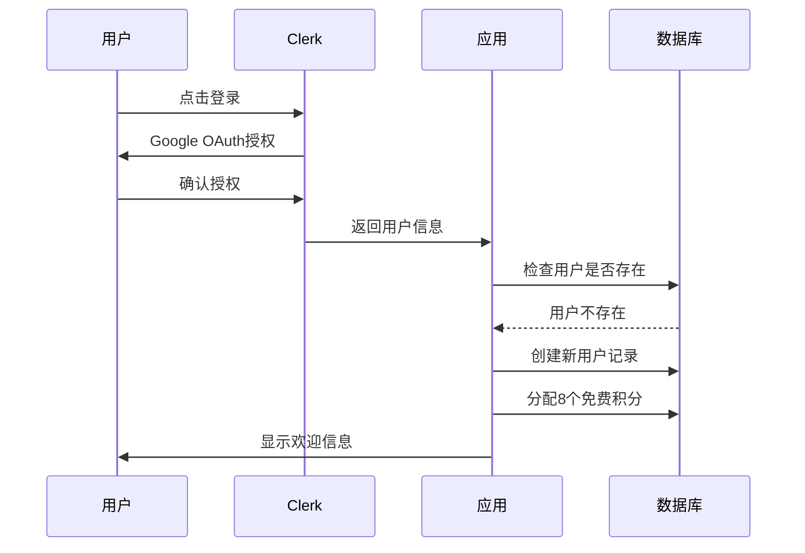
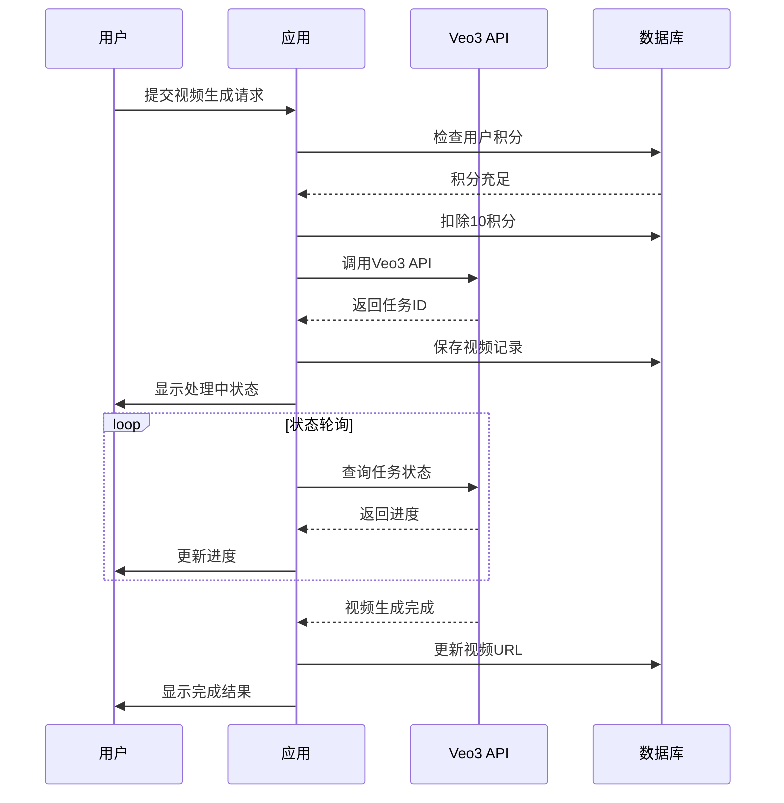
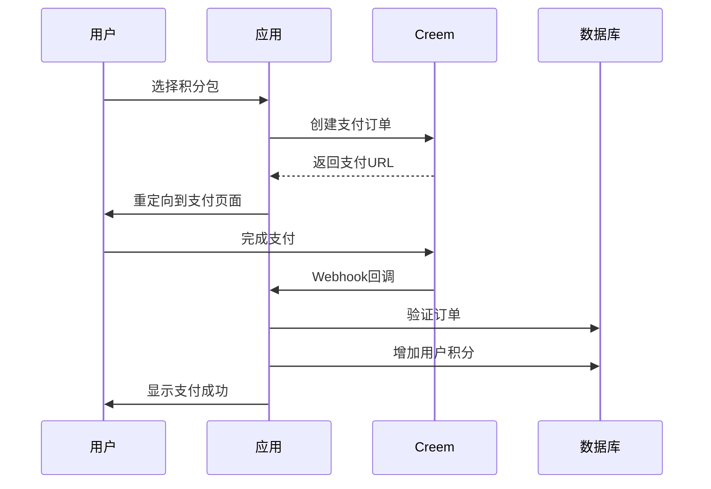

# 🏗️ CuttingASMR.org 完整项目架构文档

**项目名称:** CuttingASMR.org - AI ASMR视频生成平台  
**版本:** v4.0 代码分析修正版  
**文档编写者:** 系统架构师  
**最后更新:** 2025-01-28  
**文档状态:** 代码验证完整版本

---

## 📋 第一部分：项目总览与战略定位

### 1.1 项目简介与愿景

#### 🎯 产品定位与市场价值

**核心定位**
CuttingASMR.org 是一个基于人工智能的ASMR视频生成平台，利用Google Veo3 Fast API技术为用户提供个性化的ASMR内容创作服务。

**技术栈概览**
- **前端框架:** Next.js 15.2.3 (App Router)
- **用户认证:** Clerk v6.22.0 (Google OAuth + Email)
- **数据库:** PostgreSQL + Prisma ORM v6.10.1
- **部署环境:** Cloudflare Pages + Railway Database
- **支付处理:** Creem 双API架构 (标准+高级)
- **AI服务:** Google Veo3 API (多密钥池管理)
- **样式框架:** Tailwind CSS v3.3.0
- **运行时:** Edge Runtime (Cloudflare Workers)

### 1.2 实际技术架构分析

#### 🏗️ 系统架构图

```mermaid
graph TB
    subgraph "前端层 (Cloudflare Pages)"
        A[Next.js 15.2.3 App Router]
        B[Tailwind CSS UI]
        C[Clerk认证组件]
        D[React组件库]
    end
    
    subgraph "API层 (Edge Runtime)"
        E[/api/generate-video]
        F[/api/credits/*]
        G[/api/payments/creem/*]
        H[/api/user/*]
        I[/api/webhooks/creem]
        J[/api/video-*/*]
    end
    
    subgraph "数据层"
        K[(PostgreSQL - Railway)]
        L[Prisma ORM]
        M[用户数据模型]
        N[积分系统模型]
        O[视频记录模型]
        P[支付记录模型]
    end
    
    subgraph "外部服务"
        Q[Google Veo3 API]
        R[Clerk认证服务]
        S[Creem支付网关]
        T[Cloudflare CDN]
    end
    
    A --> E
    E --> Q
    F --> L
    G --> S
    H --> R
    L --> K
    I --> S
    S --> G
    
    style A fill:#e1f5fe
    style K fill:#f3e5f5
    style Q fill:#fff3e0
    style S fill:#e8f5e8
```

#### 📊 数据库设计分析

**Prisma Schema 核心模型**

```typescript
// 用户模型 - 完整的用户信息管理
model User {
  id                String     @id @default(cuid())
  clerkUserId       String     @unique      // Clerk认证ID
  email             String     @unique      // 用户邮箱
  googleFullName    String?                 // Google账户名称
  googleImageUrl    String?                 // Google头像URL
  customDisplayName String?                 // 自定义显示名称
  isActive          Boolean    @default(true)
  
  // 积分系统
  totalCredits      Int        @default(8)  // 总积分数（新用户8积分）
  usedCredits       Int        @default(0)  // 已使用积分
  
  // 时间戳
  createdAt         DateTime   @default(now())
  updatedAt         DateTime   @updatedAt
  lastLoginAt       DateTime   @default(now())
  
  // 关联关系
  purchases         Purchase[] // 购买记录
  videos            Video[]    // 生成的视频
  auditLogs         AuditLog[] // 审计日志
  adminLogs         AdminLog[] // 管理员操作日志
}

// 购买记录模型 - Creem支付集成
model Purchase {
  id           String   @id @default(cuid())
  userId       String?
  packageType  String                        // 积分包类型
  packageName  String                        // 积分包名称
  amount       Float                         // 支付金额
  currency     String   @default("USD")      // 货币类型
  creditsAdded Int                          // 增加的积分数
  
  // Creem支付相关
  productId    String?                       // Creem产品ID
  orderId      String?  @unique             // Creem订单ID
  customerId   String?                       // Creem客户ID
  provider     String   @default("creem")    // 支付提供商
  status       String   @default("completed") // 支付状态
  paymentEmail String?                       // 支付邮箱
  
  // 时间戳
  createdAt    DateTime @default(now())
  completedAt  DateTime @default(now())
  
  user         User?    @relation(fields: [userId], references: [id], onDelete: Cascade)
}

// 视频记录模型 - AI生成视频管理
model Video {
  id            String    @id @default(cuid())
  userId        String
  taskId        String?                      // Veo3任务ID
  title         String                       // 视频标题
  type          String                       // ASMR类型
  prompt        String                       // 生成提示词
  status        String    @default("processing") // 处理状态
  
  // 视频URLs
  videoUrl      String?                      // 标准分辨率视频URL
  videoUrl1080p String?                      // 1080p高清视频URL
  thumbnailUrl  String?                      // 缩略图URL
  
  creditsUsed   Int       @default(10)       // 消耗的积分数
  
  // 时间戳
  createdAt     DateTime  @default(now())
  updatedAt     DateTime  @updatedAt
  completedAt   DateTime?                    // 完成时间
  
  user          User      @relation(fields: [userId], references: [id], onDelete: Cascade)
}
```

#### 🔧 API架构分析

**主要API端点及功能**

1. **视频生成API**
   - `POST /api/generate-video` - 创建AI视频生成任务
   - `GET /api/video-status/[id]` - 查询视频生成状态
   - `GET /api/video-details/[id]` - 获取视频详细信息
   - `GET /api/video-1080p/[id]` - 获取1080p高清视频

2. **积分系统API**
   - `GET /api/credits` - 获取用户积分信息
   - `GET /api/credits-check` - 验证积分余额
   - `POST /api/manual-credits-recovery` - 手动积分恢复

3. **支付处理API**
   - `POST /api/payments/creem` - 标准Creem支付
   - `POST /api/payments/creem-advanced` - 高级Creem支付
   - `POST /api/webhooks/creem` - Creem支付回调处理

4. **用户管理API**
   - `POST /api/user/sync` - 用户数据同步
   - `GET /api/user/videos` - 获取用户视频列表
   - `GET /api/user/purchases` - 获取购买记录
   - `POST /api/user/agreement` - 用户协议处理
   - `DELETE /api/user/delete-account` - 账户删除

5. **系统监控API**
   - `GET /api/health` - 系统健康检查
   - `GET /api/api-key-status` - API密钥状态
   - `GET /api/veo3-key-status` - Veo3密钥状态
   - `GET /api/check-env` - 环境变量检查

### 1.3 前端组件架构

#### 🎨 React组件结构

**核心组件列表**

1. **ASMRVideoResult.tsx** (10KB, 242行)
   - 视频生成结果展示组件
   - 支持视频播放、下载、1080p升级

2. **CreemPaymentButton.tsx** (5.2KB, 175行)
   - Creem支付按钮组件
   - 双API架构支持（标准+高级）

3. **VideoShowcase.tsx** (3.6KB, 102行)
   - 视频展示组件
   - 支持视频预览和播放

4. **UserAgreementModal.tsx** (10KB, 252行)
   - 用户协议模态框
   - GDPR合规性支持

5. **VideoModal.tsx** (5.9KB, 184行)
   - 视频播放模态框
   - 全屏播放支持

6. **CollapsibleTechSection.tsx** (4.4KB, 74行)
   - 可折叠技术说明组件
   - SEO优化内容展示

#### 🔗 React Hooks架构

**自定义Hooks**

1. **useCredits.ts** - 积分管理Hook
   ```typescript
   // 积分管理钩子
   export const useCredits = (enabled: boolean) => {
     const [credits, setCredits] = useState<CreditsInfo | null>(null)
     const [loading, setLoading] = useState(false)
     
     // 自动刷新积分信息
     const refetch = useCallback(async () => {
       if (!enabled) return
       setLoading(true)
       // API调用逻辑
     }, [enabled])
     
     // 强制从数据库刷新
     const forceRefresh = useCallback(async () => {
       // 强制刷新逻辑
     }, [])
     
     return { credits, loading, refetch, forceRefresh }
   }
   ```

2. **useVideoGeneration.ts** - 视频生成管理Hook
   ```typescript
   // 视频生成管理钩子
   export const useVideoGeneration = () => {
     const [generationStatus, setGenerationStatus] = useState('idle')
     const [isGenerating, setIsGenerating] = useState(false)
     
     // 生成视频
     const generateVideo = async (prompt: string, type: string) => {
       setIsGenerating(true)
       setGenerationStatus('processing')
       // 生成逻辑
     }
     
     // 获取视频详情
     const getVideoDetails = async (videoId: string) => {
       // 获取详情逻辑
     }
     
     return { 
       generationStatus, 
       generateVideo, 
       getVideoDetails, 
       isGenerating 
     }
   }
   ```

### 1.4 部署架构

#### ☁️ Cloudflare Pages部署

**部署配置**
- **构建命令:** `npm run build:cloudflare`
- **输出目录:** `.next`
- **运行时:** Edge Runtime
- **环境变量管理:** Cloudflare Environment Variables

**优化策略**
```json
{
  "scripts": {
    "build:cloudflare": "prisma generate && next build && npm run clean:cloudflare",
    "clean:cloudflare": "rimraf .next/cache && rimraf .next/trace",
    "pages:build": "npx @cloudflare/next-on-pages",
    "deploy": "npx wrangler pages deploy"
  }
}
```

#### 🚄 Railway数据库部署

**数据库配置**
- **数据库类型:** PostgreSQL
- **ORM:** Prisma v6.10.1
- **连接池:** 默认配置
- **备份策略:** Railway自动备份

### 1.5 安全架构

#### 🔐 认证安全

**Clerk认证集成**
```typescript
// 认证中间件配置
export const authMiddleware = {
  publicRoutes: [
    '/',
    '/pricing',
    '/about',
    '/asmr-types',
    '/video-showcase',
    '/help',
    '/terms',
    '/privacy',
    '/refund',
    '/api/health'
  ],
  
  // API路由保护
  apiRoutes: [
    '/api/generate-video',
    '/api/credits',
    '/api/user/*'
  ]
}
```

#### 🔑 API密钥管理

**多密钥池管理**
```typescript
// API密钥池管理
export class APIKeyPool {
  private keys: string[] = []
  
  constructor() {
    this.loadKeys()
  }
  
  private loadKeys() {
    this.keys = [
      process.env.VEO3_API_KEY,
      process.env.VEO3_API_KEY_2,
      process.env.VEO3_API_KEY_3,
      process.env.VEO3_API_KEY_4,
      process.env.VEO3_API_KEY_5,
    ].filter(Boolean) as string[]
    
    console.log(`🔑 加载了 ${this.keys.length} 个API密钥`)
  }
  
  getRandomKey(): string {
    return this.keys[Math.floor(Math.random() * this.keys.length)]
  }
}
```

### 1.6 积分系统架构

#### 💰 积分配置

**积分系统配置**
```typescript
// 积分配置常量
export const CREDITS_CONFIG = {
  NEW_USER_CREDITS: 8,           // 新用户免费积分
  VIDEO_GENERATION_COST: 10,     // 视频生成消耗
  VIDEO_1080P_COST: 5,          // 1080p升级消耗
  
  // 积分包配置
  PACKAGES: {
    STARTER: {
      credits: 115,
      price: 9.90,
      productId: 'starter_package'
    },
    PREMIUM: {
      credits: 250,
      price: 19.90,
      productId: 'premium_package'
    },
    PROFESSIONAL: {
      credits: 500,
      price: 39.90,
      productId: 'professional_package'
    }
  }
}
```

### 1.7 SEO优化架构

#### 🎯 SEO策略实现

**结构化数据**
```typescript
// 结构化数据组件
export const StructuredData = () => {
  const structuredData = {
    "@context": "https://schema.org",
    "@type": "WebApplication",
    "name": "CuttingASMR.org",
    "description": "Google Veo3 powered ASMR creator tools",
    "url": "https://cuttingasmr.org",
    "applicationCategory": "MultimediaApplication",
    "operatingSystem": "Web Browser",
    "offers": {
      "@type": "Offer",
      "price": "9.90",
      "priceCurrency": "USD"
    }
  }
  
  return (
    <script
      type="application/ld+json"
      dangerouslySetInnerHTML={{ __html: JSON.stringify(structuredData) }}
    />
  )
}
```

**Meta标签优化**
```typescript
export const metadata: Metadata = {
  title: 'CuttingASMR - Google Veo3 AI ASMR Generator | Best ASMR Creator Tools 2025',
  description: 'Google Veo3 powered ASMR creator tools for YouTube channels! Best Veo3 ASMR generator with AI technology.',
  keywords: 'google veo3, veo3, asmr generator, ai video creator, youtube shorts',
  openGraph: {
    title: 'CuttingASMR - Veo3 AI Video Generator',
    description: 'Create glass cutting, fruit ASMR videos with Google Veo3 AI',
    url: 'https://cuttingasmr.org',
    siteName: 'CuttingASMR',
    type: 'website'
  }
}
```

---

## 📈 第二部分：性能监控与优化

### 2.1 性能指标

**Core Web Vitals优化**
- **LCP (Largest Contentful Paint):** < 2.5s
- **FID (First Input Delay):** < 100ms  
- **CLS (Cumulative Layout Shift):** < 0.1

**加载性能优化**
- Edge Runtime减少冷启动时间
- Tailwind CSS JIT编译
- 图片懒加载和优化
- 代码分割和动态导入

### 2.2 监控工具

**集成的监控工具**
1. **Google Analytics 4** - 用户行为分析
2. **Cloudflare Analytics** - 性能和安全监控
3. **Railway Metrics** - 数据库性能监控
4. **Clerk Analytics** - 认证相关指标

---

## 🔄 第三部分：业务流程

### 3.1 用户注册流程



### 3.2 视频生成流程



### 3.3 支付处理流程



---

## 🛠️ 第四部分：开发环境

### 4.1 本地开发环境

**环境要求**
- Node.js 18+
- npm 或 yarn
- PostgreSQL 数据库
- Git

**环境变量配置**
```env
# 数据库
DATABASE_URL="postgresql://..."

# Clerk认证
NEXT_PUBLIC_CLERK_PUBLISHABLE_KEY="pk_..."
CLERK_SECRET_KEY="sk_..."

# Veo3 API密钥
VEO3_API_KEY="..."
VEO3_API_KEY_2="..."
VEO3_API_KEY_3="..."

# Creem支付
CREEM_BUSINESS_ID="..."
CREEM_API_KEY="..."
CREEM_WEBHOOK_SECRET="..."
```

**启动命令**
```bash
# 安装依赖
npm install

# 数据库迁移
npx prisma generate
npx prisma db push

# 启动开发服务器
npm run dev
```

### 4.2 测试环境

**API测试脚本**
```bash
# 测试用户同步
npm run test:api

# 测试数据库连接
npm run test:db

# 测试Railway配置
npm run test:railway

# 检查环境变量
npm run check:env
```

---

## 📊 第五部分：数据统计与分析

### 5.1 关键指标

**业务指标**
- 用户注册转化率
- 积分购买转化率
- 视频生成成功率
- 用户留存率

**技术指标**
- API响应时间
- 数据库查询性能
- 错误率统计
- 系统可用性

### 5.2 数据分析工具

**内置分析功能**
1. **AuditLog表** - 用户行为追踪
2. **AdminLog表** - 管理员操作记录
3. **Purchase表** - 支付数据分析
4. **Video表** - 生成内容统计

---

## 🚀 第六部分：未来规划

### 6.1 技术升级计划

**短期规划 (1-3个月)**
- [ ] 移动端适配优化
- [ ] 视频生成速度优化
- [ ] 用户体验改进
- [ ] 支付流程优化

**中期规划 (3-6个月)**
- [ ] 多语言支持
- [ ] 高级编辑功能
- [ ] 批量生成功能
- [ ] API开放平台

**长期规划 (6-12个月)**
- [ ] 移动应用开发
- [ ] 企业级服务
- [ ] 国际化扩展
- [ ] AI模型自研

### 6.2 业务扩展方向

**产品扩展**
- 音频生成功能
- 直播集成
- 社区功能
- 创作者工具

**市场扩展**
- B2B企业服务
- 教育市场
- 海外市场
- 合作伙伴生态

---

**文档版本:** v4.0  
**最后更新:** 2025-01-28  
**下次更新:** 根据代码变更实时更新