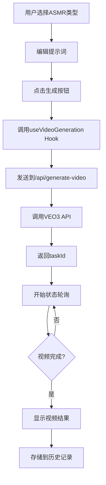

# ASMR视频生成应用 - 项目架构分析报告

## 📋 项目概述

**项目名称**: CuttingASMR.org - AI ASMR视频生成平台  
**技术栈**: Next.js 14 + TypeScript + React + TailwindCSS  
**部署平台**: Vercel/Railway  
**核心功能**: AI驱动的ASMR视频生成，集成VEO3 API  

## 🏗️ 项目架构总览

```
佛山code/
├── 📁 src/                     # 源代码目录
│   ├── 📁 app/                 # Next.js 14 App Router
│   │   ├── 📁 api/             # API路由集合
│   │   │   ├── generate-video/ # 视频生成端点
│   │   │   ├── video-1080p/    # 1080P视频获取
│   │   │   ├── video-details/  # 视频详情查询
│   │   │   └── video-status/   # 视频状态轮询
│   │   ├── layout.tsx          # 根布局组件
│   │   ├── page.tsx            # 首页组件
│   │   └── globals.css         # 全局样式
│   ├── 📁 components/          # React组件库
│   │   ├── ASMRVideoResult.tsx # 视频结果展示
│   │   ├── ImageUploader.tsx   # 图片上传组件
│   │   └── VideoHistory.tsx    # 历史记录组件
│   ├── 📁 hooks/               # 自定义React Hooks
│   │   └── useVideoGeneration.ts # 视频生成逻辑Hook
│   └── 📁 lib/                 # 工具库
│       └── veo3-api.ts         # VEO3 API客户端
├── 📁 public/                  # 静态资源
├── 📄 package.json             # 依赖配置
├── 📄 next.config.js           # Next.js配置
├── 📄 tailwind.config.ts       # TailwindCSS配置
└── 📄 tsconfig.json            # TypeScript配置
```

## 🔧 技术栈分析

### 前端框架
```json
{
  "框架": "Next.js 14.0.0",
  "特性": ["App Router", "Server Components", "API Routes"],
  "React版本": "18.x",
  "TypeScript": "5.x",
  "样式": "TailwindCSS 3.3.0"
}
```

### 核心依赖
```json
{
  "production": {
    "next": "14.0.0",
    "react": "^18",
    "react-dom": "^18", 
    "lucide-react": "^0.515.0",
    "serve": "^14.2.1"
  },
  "development": {
    "typescript": "^5",
    "tailwindcss": "^3.3.0",
    "eslint": "^8",
    "@types/node": "^20"
  }
}
```

## 🎯 功能模块架构

### 1. 视频生成核心模块

#### API路由设计
```typescript
// API端点结构
/api/generate-video/        # POST - 视频生成请求
/api/video-status/[id]/     # GET  - 状态查询
/api/video-details/[id]/    # GET  - 详情获取  
/api/video-1080p/[id]/      # GET  - 高清版本
```

#### VEO3 API集成
```typescript
// 核心接口定义
interface TextToVideoRequest {
  prompt: string;
  model?: 'veo3' | 'veo3_fast';
  aspectRatio?: '16:9' | '9:16' | '1:1';
  duration?: string;
}

// API客户端类
class Veo3ApiClient {
  generateTextToVideo()    # 视频生成
  getVideoStatus()         # 状态查询
  getVideoDetails()        # 详情获取
  get1080PVideo()          # 高清获取
  pollVideoStatus()        # 状态轮询
}
```

### 2. 用户界面模块

#### 组件架构
```typescript
// 主要组件结构
ASMRVideoStudio (主页)
├── Header               # 顶部导航
├── Hero Section         # 英雄区域
├── Generator Panel      # 生成器面板
│   ├── ASMRTypeSelector # ASMR类型选择
│   ├── PromptEditor     # 提示词编辑
│   └── GenerateButton   # 生成按钮
├── Result Panel         # 结果展示面板
│   ├── ASMRVideoResult  # 视频结果组件
│   └── VideoHistory     # 历史记录组件
└── Footer               # 页脚
```

#### 状态管理
```typescript
// 核心状态设计
interface AppState {
  selectedASMRType: string;     # 选择的ASMR类型
  prompt: string;               # 提示词内容
  freeTrialsLeft: number;       # 剩余免费次数
  isSubscribed: boolean;        # 订阅状态
  generationStatus: object;     # 生成状态
}
```

### 3. ASMR内容类型系统

#### 预设类型配置
```typescript
// 8种ASMR类型预设
const asmrTypes = [
  { id: 'default', name: 'Default', icon: '🎵' },
  { id: 'ice-cutting', name: 'Ice Cutting', icon: '🧊' },
  { id: 'hot-iron', name: 'Hot Iron Forging', icon: '🔥' },
  { id: 'lime-cutting', name: 'Lime Cutting', icon: '🍋' },
  { id: 'crystal-burger', name: 'Crystal Burger', icon: '🍔' },
  { id: 'fireplace', name: 'Fireplace', icon: '🔥' },
  { id: 'keyboard', name: 'Keyboard Typing', icon: '⌨️' },
  { id: 'nail-care', name: 'Nail Care', icon: '💅' }
];
```

## 🔄 数据流架构

### 视频生成流程


### API交互架构
```typescript
// 前端 -> 后端 -> VEO3 API 的数据流
Client Component
  ↓ useVideoGeneration Hook
API Route (/api/generate-video)
  ↓ Veo3ApiClient
VEO3 External API
  ↓ Response
Local Storage (历史记录)
```

## 🎨 UI/UX设计架构

### 设计系统
```css
/* 颜色主题 */
:root {
  --primary: purple-600;      /* 主色调 */
  --secondary: blue-600;      /* 辅助色 */
  --accent: gradient;         /* 渐变色 */
  --background: purple-50;    /* 背景色 */
}

/* 组件风格 */
- 圆角设计: rounded-3xl, rounded-2xl
- 阴影系统: shadow-2xl, shadow-lg  
- 渐变背景: gradient-to-br
- 玻璃态效果: backdrop-blur-sm
```

### 响应式布局
```typescript
// 断点设计
sm: 640px   // 小屏幕
md: 768px   // 中等屏幕  
lg: 1024px  // 大屏幕
xl: 1280px  // 超大屏幕

// 网格系统
grid-cols-1 lg:grid-cols-2  // 主内容区域
grid-cols-3                 // ASMR类型选择
```

## 🚀 性能优化架构

### 代码优化
- **组件懒加载**: 使用 React.lazy()
- **图片优化**: Next.js Image组件
- **代码分割**: Next.js自动代码分割
- **静态生成**: 支持SSG/SSR

### API优化
- **状态轮询**: 智能轮询机制，避免过度请求
- **错误重试**: 自动重试失败的API请求
- **缓存策略**: 本地存储历史记录，减少API调用

### 用户体验优化
- **加载状态**: 详细的加载进度显示
- **错误处理**: 友好的错误提示
- **离线支持**: 本地历史记录访问

## 📊 SEO与营销架构

### SEO优化策略
```typescript
// 元数据优化
export const metadata = {
  title: 'CuttingASMR.org - AI ASMR Video Generator',
  description: '专业AI ASMR视频生成器',
  keywords: 'ASMR,AI ASMR,视频生成器',
  openGraph: { /* 社交媒体优化 */ }
}

// 结构化数据
schema.org/WebApplication  // 应用程序标记
schema.org/Offer          // 价格信息标记
```

### 内置SEO监控
```javascript
// 关键词密度检查
- 主关键词安全阈值: 3.5%
- 次要关键词阈值: 3.0%
- 重复短语检测
- 开发环境实时监控
```

## 🔒 安全架构

### API安全
- **环境变量**: 敏感信息存储在环境变量
- **请求验证**: API请求参数验证
- **错误处理**: 安全的错误信息返回
- **CORS配置**: 跨域请求控制

### 数据安全
- **本地存储**: 敏感数据避免明文存储
- **用户隐私**: 最小化数据收集
- **API密钥**: 服务端安全管理

## 🎯 业务逻辑架构

### 免费试用系统
```typescript
// 试用次数管理
const [freeTrialsLeft, setFreeTrialsLeft] = useState(2);
const [isSubscribed, setIsSubscribed] = useState(false);

// 使用限制检查
if (!isSubscribed && freeTrialsLeft <= 0) {
  // 提示订阅
}
```

### 用户状态管理
- **试用用户**: 2次免费生成
- **订阅用户**: 根据计划限制使用
- **历史记录**: 本地存储，无服务器负担

## 📈 可扩展性架构

### 模块化设计
- **组件复用**: 高度模块化的React组件
- **Hook抽象**: 业务逻辑与UI分离
- **API抽象**: 易于切换不同的AI服务

### 功能扩展点
- **新ASMR类型**: 配置化添加新类型
- **支付集成**: 预留订阅系统接口
- **用户系统**: 预设用户认证扩展点
- **多语言**: i18n支持预留

## 🛠️ 开发工具链

### 构建工具
```json
{
  "开发服务器": "next dev",
  "生产构建": "next build", 
  "代码检查": "eslint",
  "类型检查": "typescript",
  "样式处理": "tailwindcss + postcss"
}
```

### 部署配置
```javascript
// next.config.js 关键配置
- API路由支持: 移除 output: 'export'
- 图片优化: unoptimized: true
- 环境变量: VEO3_API_KEY, VEO3_API_BASE_URL
- 构建优化: 忽略ESLint和TypeScript错误
```

## 📋 项目文档体系

### 技术文档
- `VEO3_API_集成指南.md` - API集成详细指南
- `完整功能集成总结_Veo3_API.md` - 功能集成总结
- `修复总结_Veo3_Fast_API集成.md` - 问题修复记录
- `ASMR_Video_Result_集成总结.md` - 结果组件集成

### 业务文档  
- `ASMR用户系统架构设计.md` - 用户系统设计
- `SEO关键词策略报告.md` - SEO优化策略
- `README.md` - 项目说明文档

## 🎯 核心优势总结

### 技术优势
- ✅ **现代技术栈** - Next.js 14 + TypeScript + TailwindCSS
- ✅ **模块化架构** - 高内聚低耦合的组件设计
- ✅ **性能优化** - 智能轮询、本地缓存、代码分割
- ✅ **SEO友好** - 完整的SEO优化和监控系统

### 业务优势
- ✅ **用户体验** - 简洁直观的界面，8种ASMR类型
- ✅ **成本控制** - 本地历史记录，减少服务器负担
- ✅ **可扩展性** - 预留用户系统、支付系统接口
- ✅ **快速迭代** - 良好的代码结构支持快速功能开发

## 🚀 下一步发展规划

### 短期目标 (1-2周)
- [ ] 用户认证系统集成 (Google OAuth)
- [ ] 支付系统集成 (Stripe)
- [ ] 数据库设计和实现
- [ ] 用户仪表板开发

### 中期目标 (1-2个月)
- [ ] 移动端适配优化
- [ ] 更多ASMR类型和模板
- [ ] 视频编辑功能
- [ ] 社交分享功能

### 长期目标 (3-6个月)
- [ ] AI视频编辑功能
- [ ] 协作功能
- [ ] API开放平台
- [ ] 多语言支持

---

**更新时间**: 2024年12月  
**文档版本**: v1.0  
**维护者**: CuttingASMR开发团队 